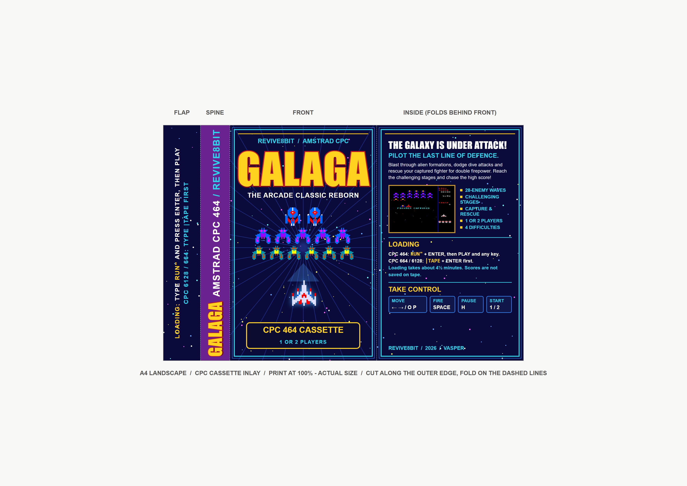

# Galaga CPC

Μια υλοποίηση του Galaga για Amstrad CPC, γραμμένη σε Z80 assembly.

## Λήψη

Κατέβασε το παιχνίδι από την [τελευταία έκδοση στο GitHub](https://github.com/vaspervnp/GalagaCPC/releases/latest):

- `galaga.dsk`: δισκέτα (`RUN"galaga.bas`), με αποθήκευση των high scores.
- `galaga.cdt`: κασέτα για emulator (`RUN"` στον 464, `|TAPE` πρώτα στον 6128).
- `galaga.wav`: η κασέτα ως ήχος, για ηχογράφηση σε πραγματική κασέτα ή φόρτωση απευθείας σε CPC 464.
- `cover-disk.pdf` / `cover-tape.pdf`: τα εξώφυλλα για εκτύπωση σε A4 στο 100%.

## Τεχνικά χαρακτηριστικά

- **Στόχος:** Amstrad CPC 464 / 6128.
- **Επεξεργαστής:** Zilog Z80.
- **Γλώσσα και assembler:** Z80 assembly με RASM.
- **Γραφικά:** Mode 0, overscan οθόνη 192 × 272 pixels, με απευθείας προγραμματισμό του CRTC και της παλέτας Gate Array.
- **Ήχος:** PSG AY-3-8912.
- **Είσοδος:** Πληκτρολόγιο ή joystick μέσω του matrix πληκτρολογίου CPC.
- **Μέσο διανομής:** Extended DSK image και κασέτα CDT για τον CPC 464.
- **Εισαγωγική οθόνη:** Εκτέλεση `RUN"galaga.bas` από BASIC δεσμεύει τη μνήμη από `&2000` και πάνω για το παιχνίδι, εμφανίζει την οθόνη Revive 8-bit με την παλέτα της και ξεκινά το παιχνίδι με Space ή αυτόματα μετά από 10 δευτερόλεπτα.
- **High scores:** Αποθηκεύονται μόνιμα στη δισκέτα σε αποκλειστικό raw sector· κατά την αποθήκευση γίνεται επαλήθευση με ανάγνωση.
- **Δυσκολία:** Προεπιλογή Medium· επίλεξε στην οθόνη τίτλου με αριστερά/δεξιά: Easy, Medium, Hard ή Hardest.
- **Κώδικας:** Χωρισμένος σε modules για video, χειρισμό παίκτη, εχθρούς, βολές, συγκρούσεις, στάδια, ήχο και αποθήκευση δισκέτας.

## Παιχνίδι

- Σχηματισμός όπως στο arcade: 4 Boss Galaga, δύο σειρές των 8 πεταλούδων και δύο σειρές των 8 μελισσών (36 εχθροί), που μπαίνουν σε κύματα των 8 με τις διαδρομές του arcade (από ψηλά σε δύο ρεύματα, από κάτω αριστερά και δεξιά, από ψηλά). Η πίστα 1 ξεκινά με 16 εχθρούς και κάθε κανονική πίστα προσθέτει 4, έως τους 36 από την πίστα 8. Κάθε κύμα μπαίνει αφού ολοκληρωθεί το προηγούμενο.
- Από την πίστα 10, μέλισσες που κάνουν βουτιά χωρίζονται στη μέση της διαδρομής σε τρεις εξωγήινους (σκορπιούς, σαλάχια ή ναυαρχίδες του Galaxian), με bonus αν καταρριφθούν και οι τρεις.
- Όλοι οι εχθροί σε πτήση κινούνται με μεγαλύτερο βήμα (3 γραμμές και 1,5 byte ανά frame), 1,5 φορά πιο γρήγορα από πριν.
- Bonus πίστες ανά τέσσερα στάδια, αρχίζοντας από την πίστα 3.
- Η δυσκολία αυξάνεται σταδιακά: στο Easy από την πίστα 6 επιλεγμένοι εχθροί πυροβολούν κατά την είσοδο, από την πίστα 5 όσοι κάνουν βουτιά ρίχνουν τρίτη βολή, ενώ από την πίστα 40 οι βολές αποκτούν και διαγώνια κίνηση. Στο Medium, το Hard και το Hardest η κλιμάκωση είναι 1,5, 2 και 2,5 φορές πιο γρήγορη, και οι διαγώνιες βολές ξεκινούν από την πίστα 10, 5 και 1 αντίστοιχα.
- Οι βαθμίδες από Medium και πάνω προσθέτουν γρήγορες εισόδους από ψηλά, μαζί με διαδρομές από το κέντρο και χαμηλά από τα πλάγια, και κάνουν τις επιθέσεις και τις βολές συχνότερες. Το Easy διατηρεί τους αρχικούς κανόνες.
- Στις καταδύσεις, οι εχθροί έχουν τυχαία οριζόντια ταχύτητα: περίπου το ένα τρίτο κινείται 33% γρηγορότερα, το ένα τρίτο 33% πιο αργά και οι υπόλοιποι με την κανονική ταχύτητα.
- Οι εχθροί που έχουν ήδη φτάσει στον σχηματισμό μπορούν να επιτεθούν πριν ολοκληρωθεί η είσοδος όλων των κυμάτων. Η πιθανότητα σε κάθε διάστημα επίθεσης αυξάνεται με τη δυσκολία.
- Οι εχθροί που πυροβολούν κατά την είσοδο έχουν δύο επιπλέον πιθανά σημεία βολής, με πιθανότητα από περίπου 10% στο Easy έως 50% στο Hardest.
- Εχθρικές βολές ταυτόχρονα στην οθόνη: στο Easy 2 (3 από την πίστα 10)· στο Medium από 5 έως 9, στο Hard από 6 έως 11 και στο Hardest από 7 έως 14, με σταδιακή αύξηση ανά πίστα. Οι διαγώνιες βολές σημαδεύουν το μαχητικό με κλίση 15–30 μοιρών (ανά 5).
- Υποστήριξη δεύτερου μαχητικού μετά από σύλληψη και διάσωση.
- Πίνακας Hall of Fame με πέντε εγγραφές και αρχικά τριών χαρακτήρων.
- Παρτίδα δύο παικτών (πλήκτρο `2` στην οθόνη τίτλου): οι παίκτες εναλλάσσονται σε κάθε χαμένη ζωή και ο καθένας συνεχίζει ακριβώς από εκεί που σταμάτησε. Στο τέλος, οθόνη σύγκρισης με τα στατιστικά και τον νικητή, πριν από την καταχώριση αρχικών.

## Χειρισμός

| Ενέργεια | Πληκτρολόγιο | Joystick |
|---|---|---|
| Κίνηση αριστερά / δεξιά | Βέλη ή `O` / `P` | Αριστερά / δεξιά |
| Πυροβολισμός | `Space` | Fire 1 |
| Παύση | `H` | — |
| Παρτίδα 1 / 2 παικτών (οθόνη τίτλου) | `1` ή `Space` / `2` | Fire 1 (1 παίκτης) |

## Εγχειρίδιο

- [Εγχειρίδιο στα Ελληνικά](manual-el.md) ([PDF](manual-el.pdf))
- [Game manual in English](manual-en.md) ([PDF](manual-en.pdf))

Τα PDF ξαναφτιάχνονται από τα Markdown με `python tools/make_manuals.py` (απαιτεί το πακέτο `markdown` και Chrome ή Edge).

## Εξώφυλλο κασέτας



Ένθετο κασέτας (J-card) σε πραγματικό μέγεθος σε A4 landscape: flap με οδηγίες φόρτωσης, ράχη, πρόσοψη και εσωτερικό τμήμα που διπλώνει πίσω από την πρόσοψη. Τύπωσε το [PDF](cover-tape.pdf) στο 100%, κόψε στο εξωτερικό περίγραμμα και δίπλωσε στις διακεκομμένες γραμμές. Το εξώφυλλο της δισκέτας βρίσκεται στα [cover-disk.pdf](cover-disk.pdf) / [cover-disk.jpg](cover-disk.jpg).

Ξαναφτιάχνεται με `python tools/make_tape_cover.py` (απαιτεί Pillow και Chrome ή Edge).

## Build

Από τη ρίζα του repository, εκτελέστε σε Windows:

```bat
build.bat
```

Το script απαιτεί Python 3, το `rasm_w64.exe` στη διαδρομή `G:\Amstrad` και WSL με εγκατεστημένο το `iDSK`. Παράγει τα `build\galaga.bin`, `build\galaga.sym` και `build\galaga.dsk`, το οποίο περιλαμβάνει το απλό ASCII πρόγραμμα Locomotive BASIC από το `galaga.bas`. Μετά την εκκίνηση του DSK, τρέξτε `RUN"galaga.bas` από το BASIC.

Παράγει επίσης την κασέτα `build\galaga.cdt` (2000 baud, περίπου 4,5 λεπτά φόρτωση) με το `tools\make_cdt.py`: ένα ASCII BASIC loader, την οθόνη `REVIVE8B.SCR` και το `GALAGA.BIN`. Στον 464 φορτώνει με `RUN"` και Enter· στον 6128 πληκτρολογήστε πρώτα `|TAPE`. Από κασέτα τα high scores δεν αποθηκεύονται.

Για πραγματική κασέτα, το `tools\make_tape_wav.py` βγάζει την ίδια κασέτα ως ήχο στο `build\galaga.wav` (44,1 kHz, mono, 8-bit, περίπου 12 MB). Ηχογραφήστε το σε κασέτα ή παίξτε το απευθείας στον 464 με καλώδιο κασετοφώνου, με την ένταση σχεδόν στο μέγιστο και χωρίς εφέ/equalizer. Για πιο αξιόπιστη φόρτωση από παλιές κασέτες: `python tools\make_tape_wav.py 1000` (1000 baud, περίπου 9 λεπτά).

Οι εικόνες των badges βρίσκονται στο `assets\badgesMap.png`. Για αναδημιουργία του αντίστοιχου assembly asset απαιτείται επίσης το Pillow:

```bat
python tools\make_badges_asm.py
```
