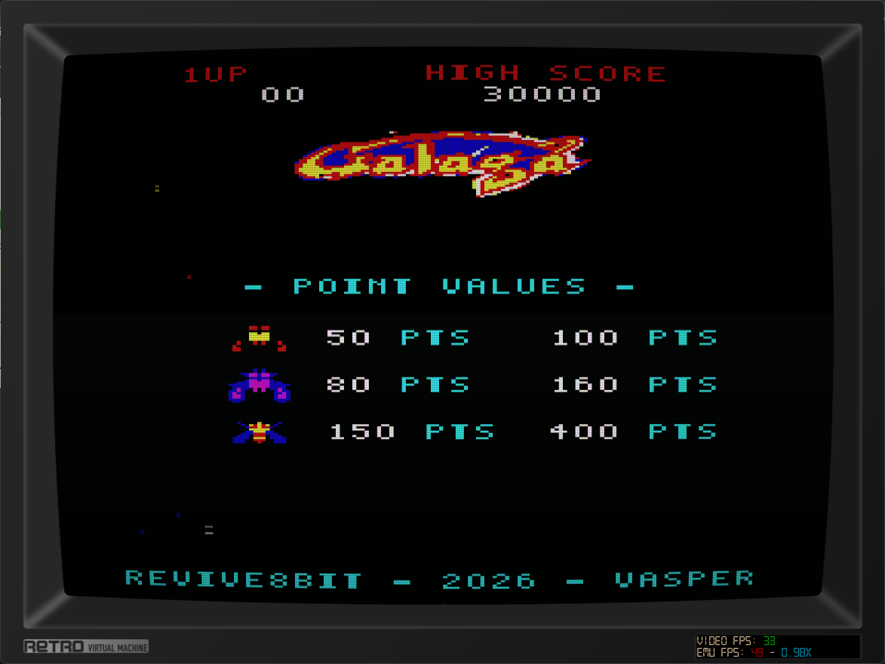
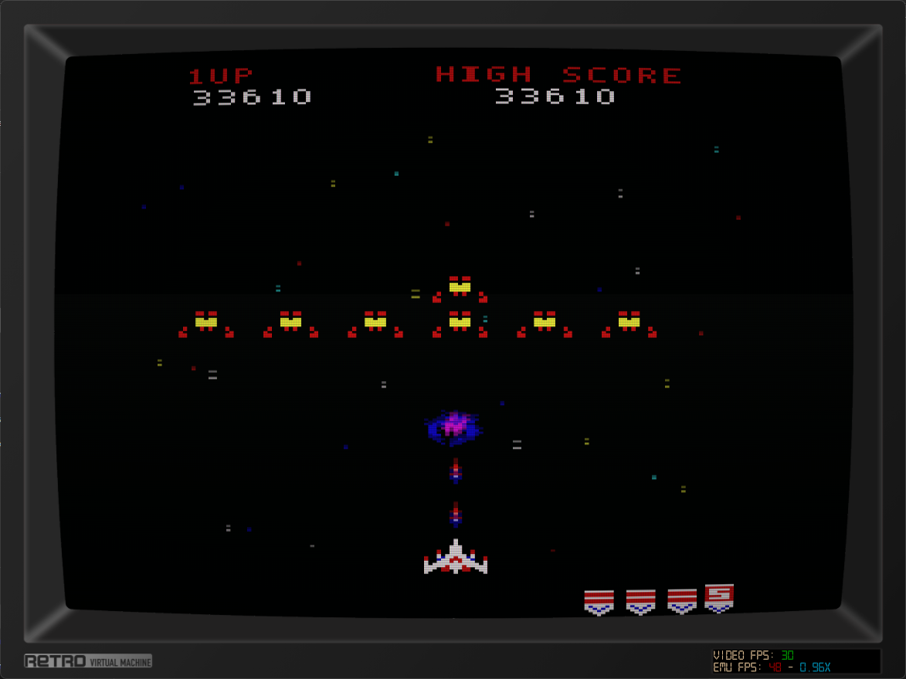
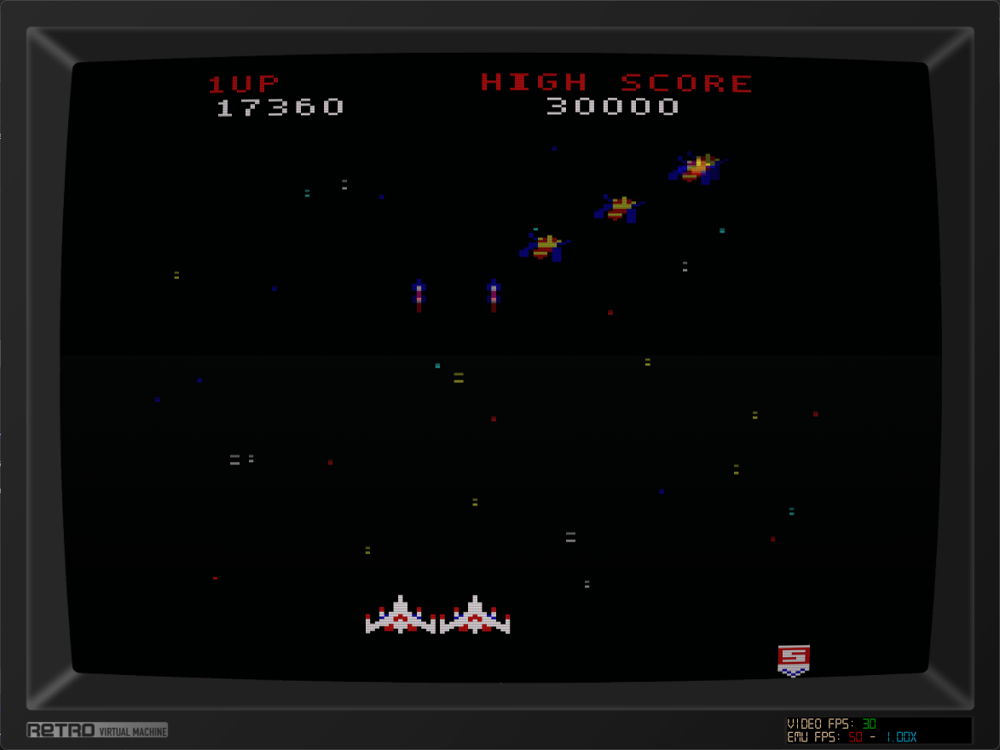
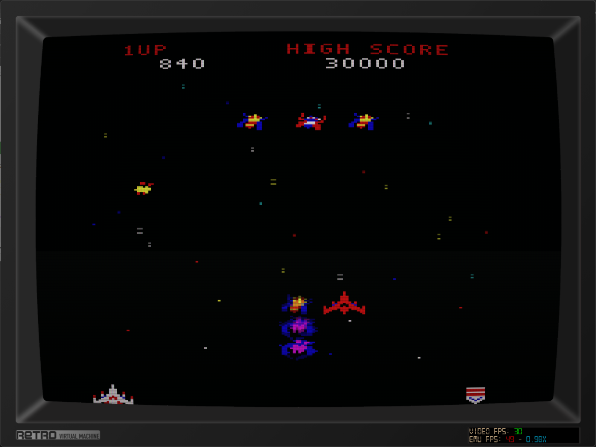
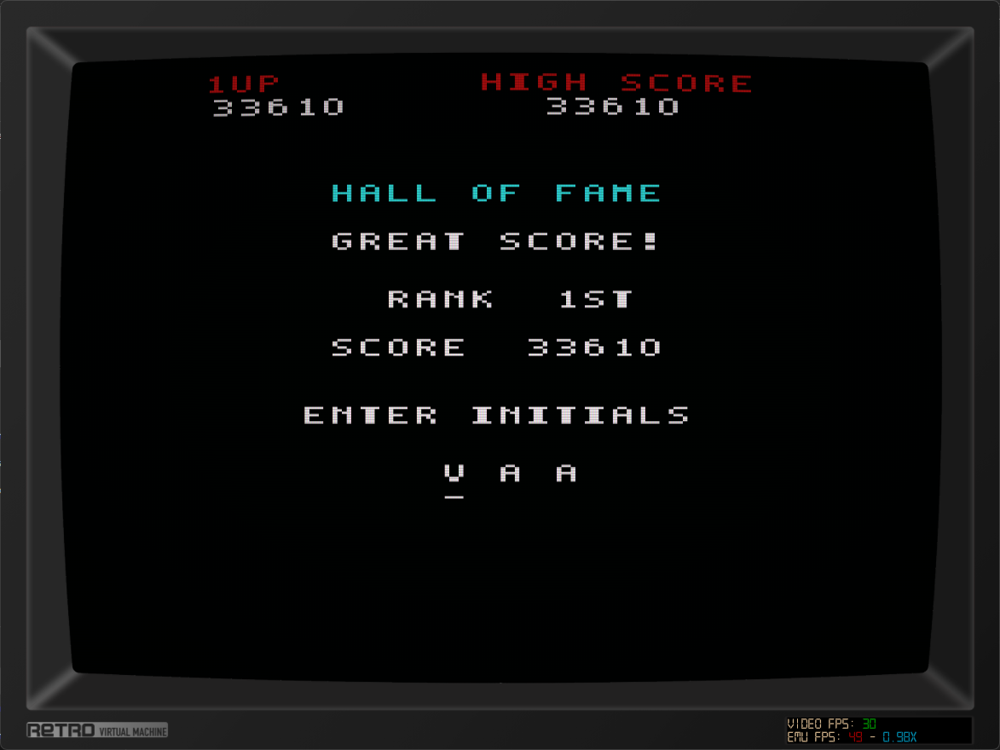
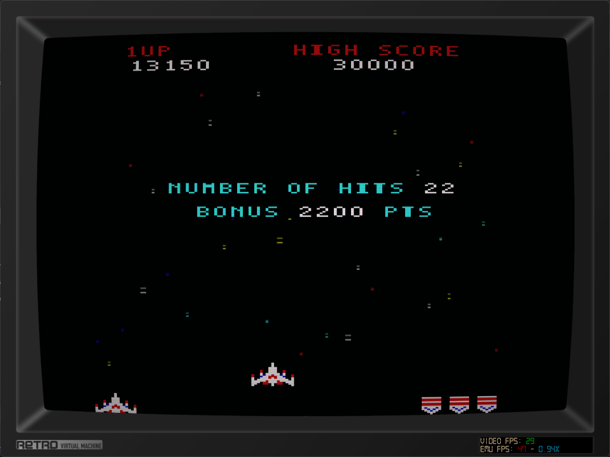

# GALAGA CPC — Εγχειρίδιο

## Σκοπός

Οδήγησε το μαχητικό σου, κατέρριψε τους σχηματισμούς των εξωγήινων και συγκέντρωσε όσο το δυνατόν περισσότερους πόντους. Η παρτίδα συνεχίζεται σε διαδοχικές πίστες μέχρι να εξαντληθούν οι ζωές σου.

*Η οθόνη τίτλου εναλλάσσει τις αξίες βαθμών με το Hall of Fame.*

## Εκκίνηση

1. Εκκίνησε τον Amstrad CPC ή τον emulator με τη δισκέτα του παιχνιδιού.
2. Στη γραμμή `Ready` του Locomotive BASIC πληκτρολόγησε `RUN"galaga.bas` και πάτησε Enter.
3. Εμφανίζεται η εισαγωγική οθόνη. Πάτησε **Space** ή περίμενε 10 δευτερόλεπτα για να φορτωθεί το παιχνίδι.
4. Στην οθόνη τίτλου πάτησε **Space** ή το **Fire 1** του joystick για να αρχίσει η παρτίδα.

## Χειρισμός

| Ενέργεια | Πληκτρολόγιο | Joystick |
|---|---|---|
| Κίνηση αριστερά | Αριστερό βέλος ή `O` | Αριστερά |
| Κίνηση δεξιά | Δεξί βέλος ή `P` | Δεξιά |
| Πυροβολισμός / επιλογή | `Space` | Fire 1 |
| Παύση / συνέχιση | `H` | — |

Κράτησε πατημένο το πλήκτρο πυρός για συνεχόμενες βολές. Κατά την παύση, πάτησε ξανά `H` για να συνεχίσεις.

## Πίστες και εχθροί

- Κάθε κανονική πίστα αρχίζει με την είσοδο ενός σχηματισμού 28 εχθρών. Κατάρριψε όλους τους εχθρούς για να προχωρήσεις.
- Κάθε τέταρτη πίστα, ξεκινώντας από την 3η (3, 7, 11, ...), είναι bonus πίστα. Προσπάθησε να πετύχεις όσο το δυνατόν περισσότερους στόχους πριν τελειώσει.
- Από τις πίστες 10–19, ένας τυχαίος εχθρός από κάθε ομάδα εισόδου πυροβολεί. Στις 20–29 πυροβολούν δύο και από την 30ή πίστα τρεις.
- Από την πίστα 40 και μετά, οι εχθρικές βολές κινούνται και διαγώνια.
- Οι αξίες πόντων φαίνονται στην οθόνη τίτλου. Οι πόντοι διαφέρουν ανάλογα με τον τύπο του εχθρού και το αν καταρρίπτεται σε σχηματισμό ή σε επίθεση.

*Πρόσεχε τις εχθρικές βολές και τις επιθέσεις των εχθρών.*

## Ζωές και δεύτερο μαχητικό

Ξεκινάς με τρεις ζωές. Οι επιπλέον ζωές απονέμονται με βάση το σκορ. Μετά τη σύλληψη του μαχητικού σου από το Boss Galaga, η εξόντωση του Boss πριν ολοκληρωθεί η σύλληψη μπορεί να απελευθερώσει το μαχητικό. Αν ολοκληρωθεί η σύλληψη, συνεχίζεις με μία ζωή λιγότερη· όταν το αιχμάλωτο μαχητικό επιστρέψει, αποκτάς διπλό σχηματισμό και μεγαλύτερη ισχύ πυρός. Μια σύγκρουση μπορεί να κοστίσει ένα από τα δύο μαχητικά.

## Σκορ και καταχώριση αρχικών

Αν το τελικό σου σκορ μπει στις πέντε πρώτες θέσεις, πληκτρολόγησε τρία αρχικά:

- Αριστερά / κάτω: προηγούμενο γράμμα.
- Δεξιά / πάνω: επόμενο γράμμα.
- `Space` ή Fire 1: επιβεβαίωση γράμματος και μετάβαση στην επόμενη θέση.

Τα πέντε κορυφαία σκορ αποθηκεύονται στη δισκέτα, ώστε να παραμένουν διαθέσιμα μετά την επανεκκίνηση. Άφησε τη δισκέτα του παιχνιδιού στον drive κατά την καταχώριση. Αν η αποθήκευση αποτύχει, το παιχνίδι εμφανίζει σχετική προειδοποίηση.

## Ενδείξεις στην οθόνη

- **1UP:** το σκορ της τρέχουσας παρτίδας.
- **HIGH SCORE:** το υψηλότερο αποθηκευμένο σκορ.
- **Σκάφη στο κάτω μέρος:** οι διαθέσιμες ζωές.
- **Σήματα πίστας:** οι αξίες 1, 5, 10, 20, 30 και 50 συνδυάζονται για να δείξουν την πίστα. Για παράδειγμα, στην πίστα 4 εμφανίζονται τέσσερα σήματα του 1, στην πίστα 5 ένα σήμα του 5 και στην πίστα 6 ένα σήμα του 5 μαζί με ένα του 1.

## Συμβουλές

- Κινήσου οριζόντια και πυροβόλα σταθερά, αλλά παρατήρησε τη θέση των εχθρικών βολών.
- Στις bonus πίστες προτεραιότητα είναι να πετύχεις όσο το δυνατόν περισσότερους στόχους.
- Από την πίστα 40, υπολόγισε και την πλάγια πορεία των βολών.
- Χρησιμοποίησε το `H` για παύση όταν χρειάζεται.
