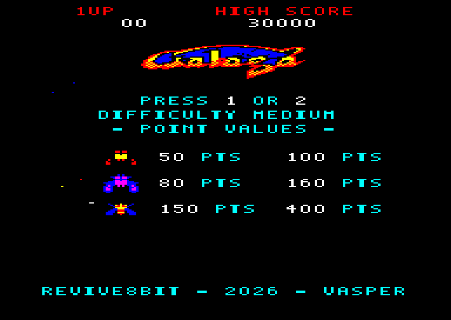
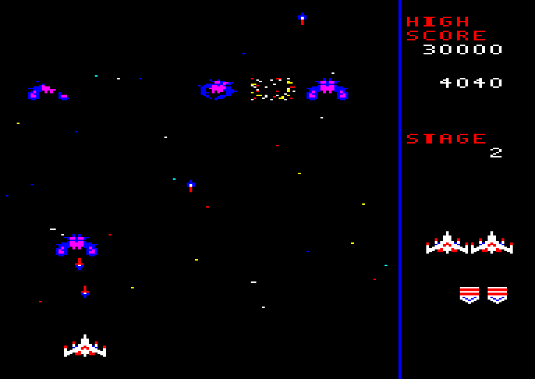
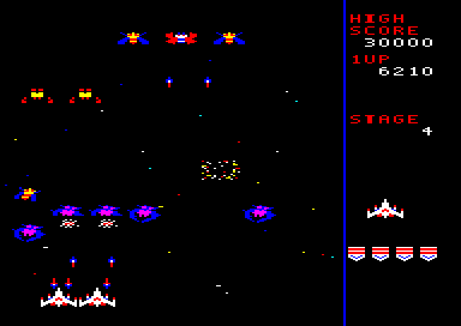
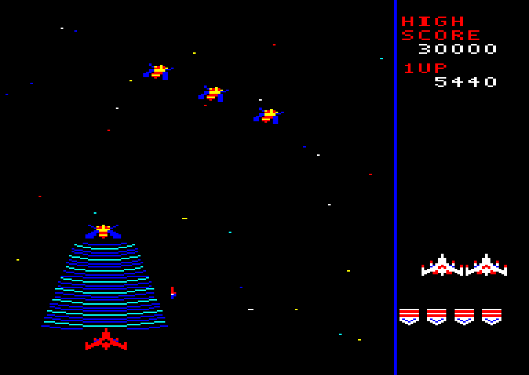
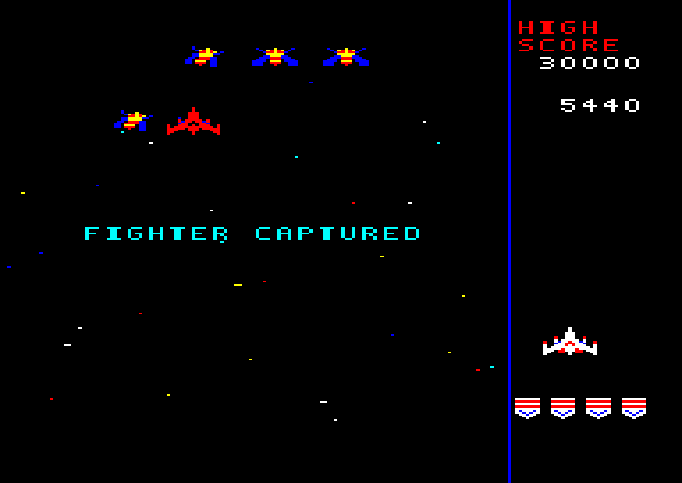
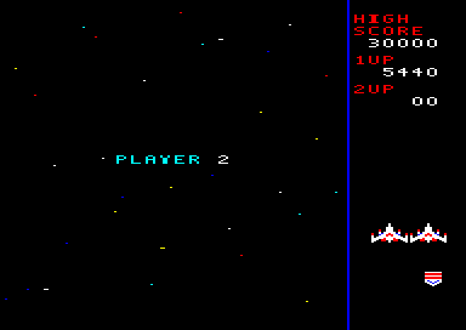
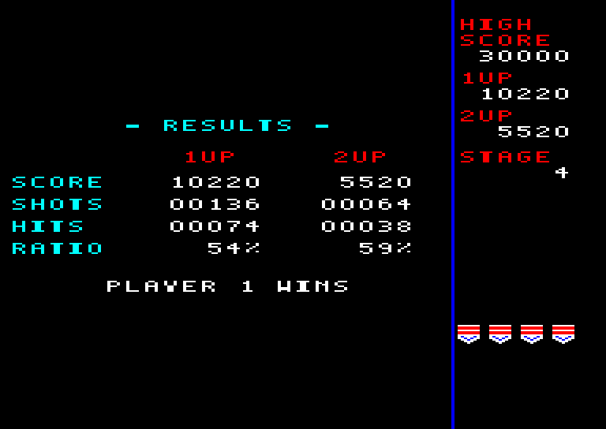
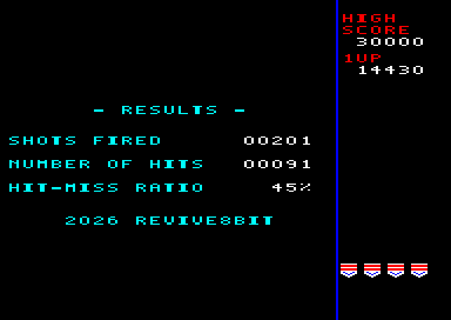
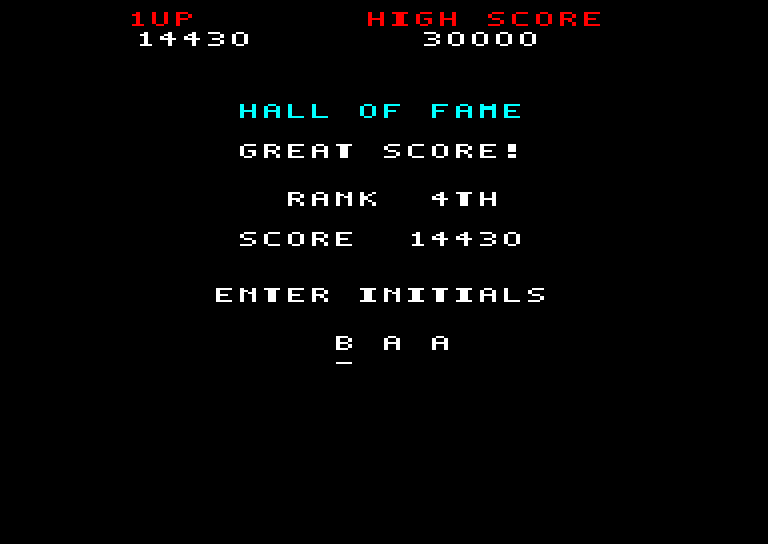
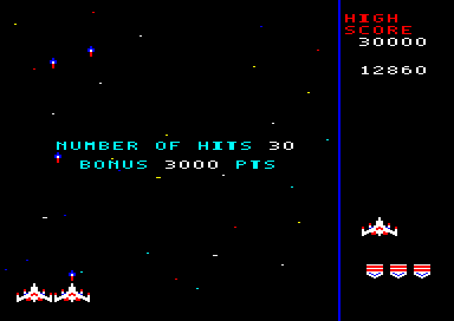

# GALAGA CPC — Game Manual

## Objective

Pilot your fighter, destroy the alien formations, and score as many points as possible. The game advances through successive stages until all lives are lost.

*The title screen alternates between point values and the Hall of Fame.*

## Starting the game

1. Start the Amstrad CPC or emulator with the game disk inserted.
2. At the Locomotive BASIC `Ready` prompt, type `RUN"galaga.bas` and press Enter.
3. The intro screen appears. Press **Space** or wait 10 seconds for the game to load.

From cassette (CPC 464, or a 6128 after typing `|TAPE`): rewind the tape, type `RUN"` and press Enter, then press PLAY and any key. The intro screen appears while the game loads (about 4½ minutes), and the game then starts by itself.

4. At the title screen, choose a difficulty with left/right, then press **1** (or **Space** / joystick **Fire 1**) for a one-player game, or **2** for a two-player game, as the blinking **PRESS 1 OR 2 PLAYERS** prompt says.

## Controls

| Action | Keyboard | Joystick |
|---|---|---|
| Move left | Left arrow or `O` | Left |
| Move right | Right arrow or `P` | Right |
| Fire / select | `Space` | Fire 1 |
| Pause / resume | `H` | — |
| 1-player / 2-player game (title screen) | `1` / `2` | — |

Hold the fire button for repeated shots. While paused, press `H` again to resume.

## Difficulty

The default is **Medium**. Choose **Easy**, **Medium**, **Hard**, or **Hardest** on the title screen with the left/right arrows, `O` / `P`, or the joystick. **Easy** preserves the game's original behavior. From **Medium** onward, each group includes enemies that enter quickly from above and take their formation positions; center and lower-side entry patterns remain in the mix. Higher settings also bring attacks and firing to earlier stages and add more firing enemies. The pressure increases further as you progress through the stages, and on the higher settings it climbs faster: on Medium, Hard and Hardest the game ramps up 1.5, 2 and 2.5 times as fast as on Easy, so attacks speed up sooner and the stage-based steps below arrive earlier.

## Stages and enemies

- The formation is laid out as in the arcade: 4 Boss Galagas on top, two rows of 8 butterflies and two rows of 8 bees, 36 enemies in all. They enter in waves of 6 to 8 using the three entrance patterns of the arcade game, which repeat between bonus stages: pattern 1 on stage 1, pattern 2 on stage 2, then patterns 1, 2 and 3 on the three regular stages after each bonus stage.
  - **Pattern 1** brings two waves at a time from both sides of the screen, in single file: butterflies and bees from the top in two streams; then the Bosses with butterflies from the lower left together with butterflies from the lower right; finally bees from the upper right and the upper left.
  - **Pattern 2** brings one wave at a time, starting from the left, with the enemies flying in side by side.
  - **Pattern 3** brings one wave at a time, starting from the left, in a single long line.

  Stages 1 and 2 bring the first 24 enemies and the full formation of 36 arrives from stage 4. Bonus stages do not change this count. Each group starts after the previous one has completed its entry. Destroy every enemy to advance.
- Enemies already in formation can attack while later groups are still entering. The chance of an attack at each interval increases with the selected difficulty.
- Enemies that fire while entering have two extra firing opportunities, each with about a 10% chance on Easy, 20% on Medium, 35% on Hard, and 50% on Hardest.
- Each enemy fires at most one shot every two seconds.
- Enemy shots on screen at once: on Easy up to 2, and 3 from stage 10. On Medium, Hard and Hardest the limit starts at 5, 6 and 7 and rises gradually as the stages advance, up to 9, 11 and 14 (reached around stage 10–12).
- Every fourth stage, starting at stage 3 (3, 7, 11, ...), is a bonus stage. Hit as many targets as possible before it ends.
- On Easy, one random enemy from each entry group fires on stages 6–11, two on stages 12–17, and three from stage 18 onward. Higher difficulties enable more shooters earlier.
- Diving enemies drop two bombs, and a third from stage 5 on Easy, 4 on Medium, 3 on Hard and 2 on Hardest.
- From stage 10, a diving bee may suddenly split into three other aliens on its way down: scorpions on stages 10–13, stingrays on 14–17 and Galaxian flagships from stage 18. Shoot all three for a bonus of 1,000, 2,000 or 3,000 points; any that fly off the bottom of the screen are gone, and so is the bonus.
- During dives, each enemy randomly chooses its horizontal speed: about one third are 33% faster, one third are 33% slower, and the rest move at normal speed.
- Enemy shots also travel diagonally from stage 40 on Easy, stage 10 on Medium, stage 5 on Hard, and from the first stage on Hardest. Diagonal shots are aimed at your fighter and come down at 15, 20, 25 or 30 degrees from vertical.
- Enemy point values are shown on the title screen. Scores vary by enemy type and whether it is destroyed in formation or while attacking.

*Watch for enemy shots and diving attacks.*

## Lives and the second fighter

You start with three lives. Extra lives are awarded as your score increases. If Boss Galaga captures your fighter, destroying the Boss before capture is complete can release it. If capture completes, the captured fighter sits right above its Boss, in formation and on its dives, and you continue with one fewer life; when the captured fighter returns, you gain a dual-fighter formation with increased firepower. A collision can cost one of the two fighters.

## Two-player game

Players take turns on the same controls. When a player loses a life, the other player takes over and continues exactly where they left off, with their own stage, enemy formation, captured fighter, lives and score. A player who loses the last life sees **GAME OVER** and the other player plays on alone.

When both players are out, a results screen compares their score, shots, hits and hit-miss ratio side by side and names the winner by score (or a draw). Then each player whose score qualifies for the Top 5 enters initials, player 1 first.

## Score and entering initials

If your final score qualifies for the Top 5, enter three initials:

- Left / down: previous letter.
- Right / up: next letter.
- `Space` or Fire 1: confirm the letter and move to the next position.

The Top 5 scores are saved to the disk and remain available after restarting. Keep the game disk in the drive while entering initials. If saving fails, the game displays a warning. The cassette version cannot save scores, so the Top 5 lasts until the computer is switched off.

## On-screen information

- **1UP / 2UP:** each player's score; the label of the player now playing blinks. 2UP appears only in a two-player game.
- **HIGH SCORE:** the highest saved score.
- **Ships along the bottom:** remaining lives.
- **Stage badges:** badges valued at 1, 5, 10, 20, 30, and 50 combine to show the current stage. For example, stage 4 shows four 1-point badges, stage 5 shows one 5-point badge, and stage 6 shows one 5-point badge plus one 1-point badge.

## Tips

- Move horizontally and keep firing, while watching the position of enemy shots.
- In bonus stages, focus on hitting as many targets as possible.
- Once enemy fire turns diagonal (stage 40 on Easy, 10 on Medium, 5 on Hard, from the start on Hardest), account for its sideways movement.
- Press `H` to pause whenever needed.
